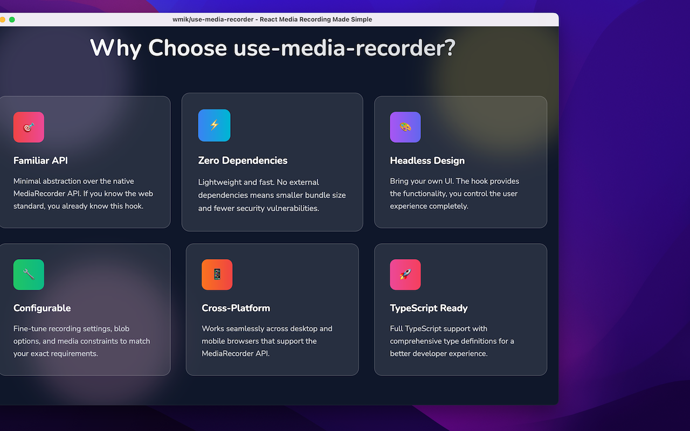
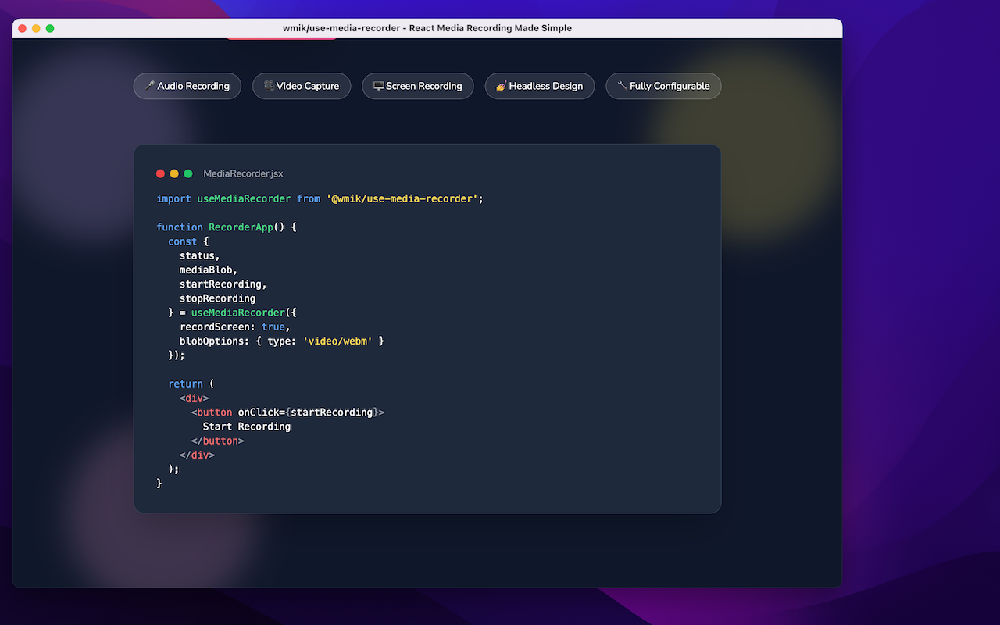
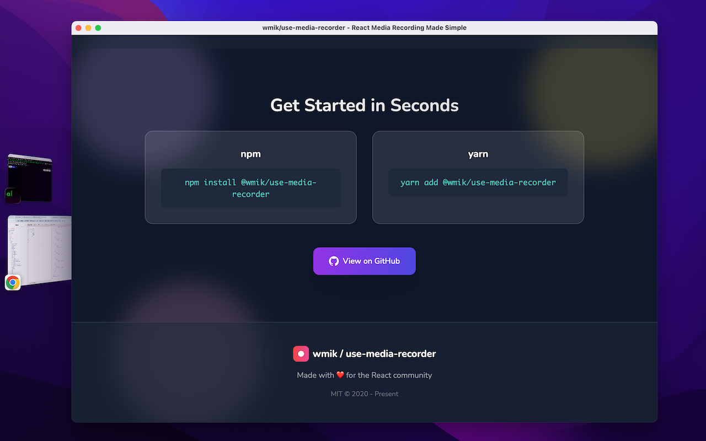
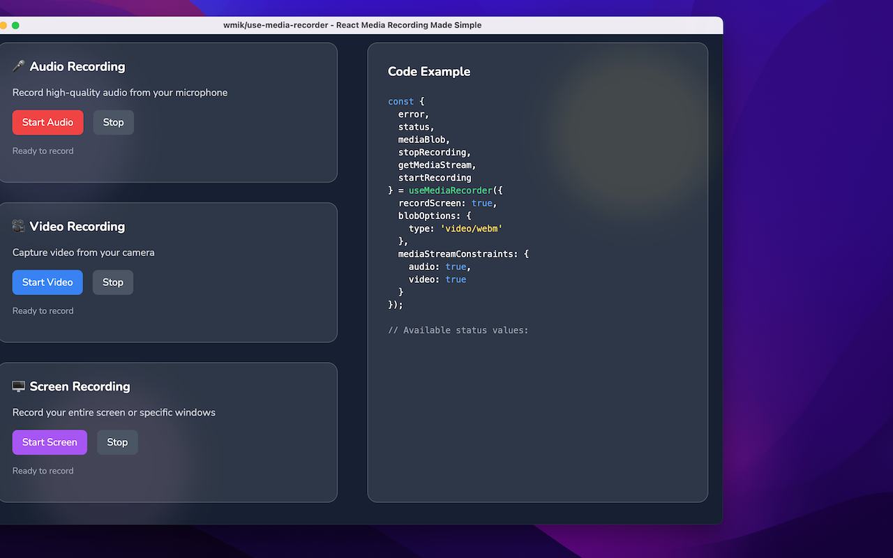

A simple React hook that makes audio, video, and screen recording effortless. Built on the MediaRecorder API with zero dependencies.
<!-- end -->


## Overview

The `use-media-recorder` project emerged from a recurring frustration in the React ecosystem: the complexity of implementing media recording functionality. While the native MediaRecorder API provides powerful capabilities, integrating it seamlessly into React applications often required extensive boilerplate code and state management. This lightweight hook abstracts away the complexity while maintaining full control over the recording process.

The solution provides developers with a clean, declarative interface for capturing audio, video, and screen recordings directly within React components. By leveraging React's hook pattern, it feels natural to developers already familiar with modern React development practices.

## Technical Highlights

- **Zero Dependencies**: Built entirely on native browser APIs
- **TypeScript Support**: Fully typed for enhanced developer experience
- **Flexible Configuration**: Supports custom MIME types, bit rates, and recording options
- **Error Handling**: Comprehensive error states and user permission management
- **Memory Efficient**: Automatic cleanup and blob URL management
- **Cross-Browser Compatible**: Graceful degradation for unsupported browsers

Since its release, the hook has gained significant traction in the React community, with thousands of weekly downloads and adoption by companies building video conferencing, content creation, and educational platforms. The project has fostered an active community contributing bug fixes, feature requests, and real-world use case feedback.

## Research & Discovery

### Technical Investigation
The research phase involved deep diving into the MediaRecorder API documentation on MDN to understand browser support, limitations, and best practices. Key findings included:

- **Browser Compatibility**: Identifying supported MIME types across different browsers
- **Performance Considerations**: Understanding memory usage patterns and optimal chunk sizes  
- **Security Model**: Investigating user permission flows and HTTPS requirements

### Competitive Analysis
A comprehensive survey of existing GitHub repositories revealed several pain points in current solutions:

- Most implementations were tightly coupled to specific UI frameworks
- Limited configuration options for advanced use cases
- Inconsistent error handling across different scenarios
- Poor documentation and real-world examples

### Community Research
Blog posts and Stack Overflow discussions highlighted common developer frustrations:

- Repetitive boilerplate code across projects
- Difficulty handling browser permission prompts gracefully
- Lack of TypeScript support in existing solutions
- Complex state management for recording states

## Planning & Architecture



### Design Philosophy
The planning phase centered around three core principles that would differentiate this hook from existing solutions:

**React-First Approach**: Leveraging React's new hooks paradigm, introduced in version 16.8, to create an API that feels native to modern React development. This meant embracing functional components and avoiding class-based patterns.

**Headless Design**: Deliberately avoiding any UI components to maximize flexibility. Developers could integrate the hook into any design system without being constrained by opinionated styling or component structure.

**Progressive Enhancement**: Building a configuration system that works out-of-the-box with sensible defaults while allowing advanced customization for power users. This meant careful API design to avoid overwhelming newcomers while not limiting experienced developers.

### API Design


The hook interface was designed to be intuitive for React developers:

```javascript
let {
  status,
  startRecording,
  stopRecording,
  mediaBlobUrl,
  error,
  clearBlobUrl
} = useMediaRecorder({ audio: true, video: true });
```

This pattern follows established React hook conventions while providing all necessary controls and state information.

## Development Process

### Rapid Prototyping Phase
The first three days focused on creating a working prototype that demonstrated the core concept. This MVP included:

- Basic recording functionality for audio and video
- Simple state management using React's `useState` and `useEffect`
- Minimal error handling for unsupported browsers
- A basic demo application to validate the API design

The rapid prototyping approach allowed for quick iteration on the API design based on actual usage patterns rather than theoretical requirements.

### Iterative Development
Following the initial prototype, development proceeded in focused sprints:

**Week 1-2**: Core functionality refinement
- Robust error handling and user feedback
- Memory management and cleanup procedures
- Cross-browser testing and compatibility fixes

**Week 3-6**: Advanced features and polish
- TypeScript definitions and type safety
- Configuration options for different recording scenarios
- Comprehensive documentation and examples

**Week 7-12**: Testing and optimization
- Performance profiling and memory leak detection
- Edge case handling (network interruptions, device changes)
- Community feedback integration and API refinements

## Release Strategy & Testing

### Version Management
The project adopted semantic versioning to provide clear expectations for breaking changes:

**Alpha Phase (Months 1-3)**: Internal testing and API stabilization
- Frequent releases with breaking changes as the API evolved
- Focus on core functionality and reliability
- Limited distribution to gather focused feedback

**Beta Phase (Months 4-6)**: Public testing and community feedback
- Feature-complete releases with stable API
- Comprehensive documentation and examples
- Community-driven testing across different use cases and environments

**Stable Release (Month 6+)**: Production-ready with backwards compatibility guarantees
- Commitment to semantic versioning for predictable updates
- Long-term support and maintenance planning

### Quality Assurance
Testing strategies included both automated and manual approaches:

- **Unit Tests**: Core hook functionality and edge cases
- **Integration Tests**: Real browser environments and permission flows  
- **Manual Testing**: Cross-browser compatibility and user experience validation
- **Community Testing**: Beta users providing feedback from production environments

## Maintenance & Community

### Open Source Governance
The project has evolved from a personal tool into a community-driven open source project. Maintenance activities include:

**Bug Triage**: Regular review of GitHub issues, categorizing by severity and impact. Critical bugs affecting recording functionality receive immediate attention, while enhancement requests are evaluated based on community needs and API consistency.

**Feature Development**: Community-driven feature requests are evaluated against the project's core philosophy. New features must enhance the hook's capabilities without adding complexity or breaking existing implementations.

**Documentation**: Continuous improvement of examples, API documentation, and troubleshooting guides based on common questions and use cases identified in GitHub issues and community discussions.

### Community Contributions
The project has benefited from diverse community contributions:

- **Bug Fixes**: Community-identified edge cases in specific browser/device combinations
- **Feature Enhancements**: New configuration options and recording modes
- **Documentation**: Real-world usage examples and integration guides
- **Testing**: Cross-platform validation and accessibility improvements

## Technical Challenges & Solutions

### Browser Compatibility
Different browsers support different MIME types and recording options. The hook includes built-in detection and fallback mechanisms to ensure consistent behavior across platforms.

### Memory Management
Recording large video files can consume significant memory. The implementation includes automatic blob URL cleanup and provides developers with tools to manage memory usage effectively.

### User Permission Handling
Browser security models require user interaction for media access. The hook provides clear error states and guidance for implementing user-friendly permission flows.

## Budget Breakdown & Resource Management

### Development Costs ($50 total)
The minimal budget reflects the project's lean development approach:

**Infrastructure ($0)**
- Domain registration and hosting for demo site
- CDN costs for documentation assets
- Development environment utilities

**Development Tools ($0)**
- Developer tools and testing services
- Code quality and security scanning tools

**Operational Expenses ($50)**
- Internet connectivity for development and testing
- Electricity costs for extended development sessions
- Meals and productivity enhancers during intensive coding periods

This budget demonstrates that impactful open source projects don't require significant financial investment, but rather focused effort and community engagement.

## Impact & Future Vision

### Current Usage
The hook has found applications in diverse domains:

- **Educational Platforms**: Enabling student video submissions and instructor feedback
- **Content Creation Tools**: Powering podcast recording and video editing applications  
- **Communication Apps**: Supporting voice notes and video messaging features
- **Accessibility Tools**: Enabling voice-controlled interfaces and audio transcription

### Future Roadmap
Planned enhancements include:

- **Advanced Recording Controls**: Pause/resume functionality and real-time audio visualization
- **Mobile Optimization**: Enhanced support for mobile browsers and PWA integration
- **Accessibility Features**: Screen reader support and keyboard-only operation modes
- **Performance Monitoring**: Built-in analytics for recording quality and success rates

## Lessons Learned

### Technical Insights
- The importance of designing APIs that feel natural within their ecosystem
- How community feedback can drive unexpected but valuable feature directions
- The balance between flexibility and simplicity in developer tools

### Project Management
- The effectiveness of rapid prototyping for validating concepts early
- How open source governance models can scale community contributions
- The value of comprehensive documentation in driving adoption

### Open Source Development
- Building sustainable maintenance practices from the project's inception
- The importance of clear contribution guidelines and code review processes
- How community engagement transforms individual projects into collective efforts

This project represents more than a technical solution—it demonstrates how identifying common developer pain points and providing elegant abstractions can create lasting value for the broader development community.