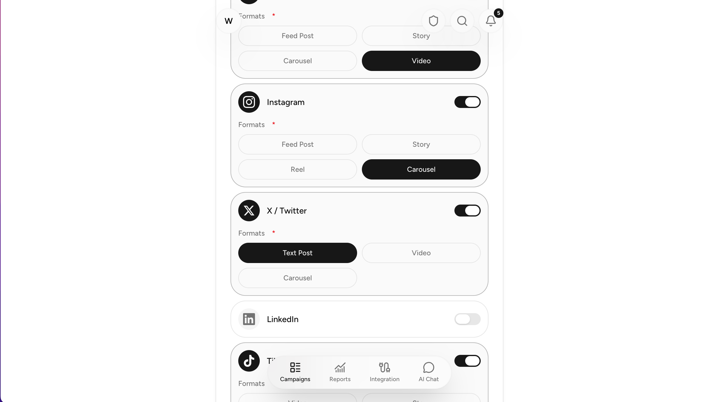
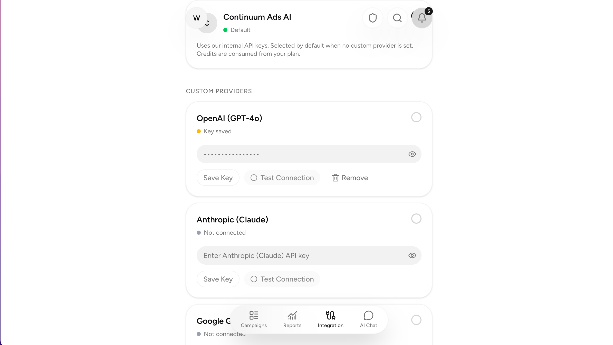
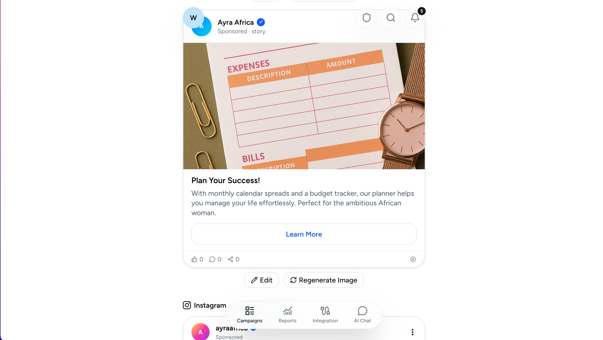

A multi-platform social media ad campaign generator that uses a multi-agent AI pipeline to turn a campaign brief into platform-optimized ad creatives — headlines, body copy, CTAs, and visual concepts — ready for Facebook, Instagram, X/Twitter, LinkedIn, TikTok, and YouTube.

## Overview

Continuum Ads solves a workflow problem that every marketer and agency owner knows well: the gap between a campaign brief and the actual ad creatives. Writing a dozen ad variations across six platforms, each with the right tone, format, and call to action, takes hours of manual work. Continuum Ads collapses that into a single form submission.

The product guides users through a 6-step campaign wizard (basics, audience & goals, platform & content, tone & creative, budget & timeline, review & generate) and then hands the brief to a three-agent AI pipeline that produces structured ad content for every selected platform. The output is editable inline — tweak headlines, copy, CTAs, or image descriptions after generation without losing your place.

The system is built on a credit model: free tier gets 5 credits, one generation costs 1 credit, and credits are refunded if generation fails. Users connect their own AI provider (OpenAI, Anthropic, or Google Gemini) or use the hosted Continnum Ads AI key. Organizations and teams share credits, campaigns, and integrations under a single tenant.

## Technical Highlights

- **Multi-Agent AI Pipeline**: Three specialized LLM agents working sequentially — a Strategist that analyzes the brief and selects a copywriting framework (AIDA, PAS, BAB, FAB, or 4Ps), a Copywriter that generates platform-specific ad variants following that framework, and a Reviewer that evaluates and refines the output against quality criteria
- **Multi-Provider Support**: OpenAI GPT-4o, Anthropic Claude Sonnet 4, and Google Gemini 2.5 Pro — users bring their own API keys or use the hosted key
- **Platform-Specific Ad Generation**: Each of the six platforms gets ad creatives tailored to its formats (feed, story, reel, carousel, video, text) with format-appropriate length and style constraints
- **Trigger.dev Background Jobs**: Content generation and image generation run as async tasks with realtime progress tracking via WebSocket hooks
- **Inline Ad Editing**: Generated ads are editable in-place — headline, copy, CTA, and image description fields without leaving the campaign view
- **Multi-Tenant Organizations**: Teams share campaigns, credits, and integrations under an org umbrella with role-based access control
- **Credit System**: Usage-based billing with auto-refund on failure, subscription tracking, and credit period resets via background jobs
- **AI Assist Drawer**: Per-field AI suggestions during campaign creation (1 credit per suggestion) that can populate individual fields or entire form steps

## Stack

**Frontend**: Next.js 16 with React 19 — the App Router made the 6-step campaign form natural to implement as nested client components with shared context. Zustand handles client-side state persistence across page refreshes (campaign drafts are synced to both localStorage and the server). Tailwind CSS 4 + shadcn/ui for the component library.

**AI Orchestration**: A custom multi-agent pipeline built on raw provider API calls (not the Vercel AI SDK's agent primitives). Each agent constructs a domain-specific prompt, calls the user's chosen LLM provider via a shared caller that handles provider-specific quirks (Gemini's system instruction format, Anthropic's `x-api-key` header, OpenAI's `response_format` parameter), and parses structured JSON output. The pipeline orchestrator chains the three agents with graceful fallback: if the Strategist fails, it falls through to the single-shot generation path.

**Background Jobs**: Trigger.dev handles all async computation — content generation, image generation via DALL-E with S3 upload, and scheduled credit resets. The realtime run hooks let the frontend display generation progress without polling.

**Database**: PostgreSQL via Prisma ORM. The `campaigns` table stores everything in a `custom` JSON column — campaign data, generated content, generation run metadata — keeping the schema flat while accommodating the highly variable campaign structure.

**Auth**: better-auth with email/password credential accounts, organization-scoped sessions, and admin user management. Sessions track the active organization and team for multi-tenant data isolation.

**Storage**: AWS S3 for uploaded reference images and generated ad images.

## Research & Discovery

### Problem Framing

The core insight was that ad copy generation is not a single creative act — it's a layered process: strategy informs structure, structure informs copy, and copy needs review. Most "AI ad generator" tools treat the whole thing as one LLM call: dump a brief into a prompt and hope for the best. The results are generic and miss platform-specific nuance.

This shaped the decision to build a multi-agent pipeline rather than a single-shot generator. Each stage has a focused responsibility, a specialized prompt, and a clearly scoped output. The system can degrade gracefully — if any stage fails, the pipeline falls back to a simpler approach rather than crashing.

### Competitive Landscape

Existing tools in the AI ad space fall into two camps. First, general-purpose LLM wrappers that accept a prompt and return text — no platform-specific formatting, no structured output, no editing workflow. Second, platform-specific tools (Facebook Ads Manager's AI features, for example) that are locked into a single ecosystem. Continuum Ads sits in between: multi-platform output with structured, editable ad creatives that respect each platform's format conventions.

The closest competitors charge per-generation fees or require monthly subscriptions. Continuum Ads' credit model — where users bring their own API key and pay only for credit-allocated features — is more economical for agencies producing high volumes of campaigns across multiple client accounts.

### Design Exploration

The agent architecture was informed by a technique that explored two fundamentally different approaches:

**Proposal (ToolLoopAgent + Critic + Reward):** Use the Vercel AI SDK's `ToolLoopAgent` class to implement three agents — Generator (creates copy variations), Critic (scores quality on clarity, brand voice, engagement), and Reward (fetches historical performance data and selects the highest-ROI variation). Each agent would use SDK tools for their specialized tasks, and the orchestration would use the SDK's `generateText` for structured workflow control.

**My Implementation (Strategist → Copywriter → Reviewer):** Three agents that each make raw fetch calls to the user's chosen LLM provider (bypassing the AI SDK entirely). The Strategist analyzes the brief first — identifying audience pain points, competitive positioning, emotional triggers — and selects a copywriting framework. The Copywriter generates ad variants guided by that strategy and framework structure. The Reviewer evaluates each ad against six criteria (brand voice, platform fit, headline impact, CTA strength, copy conciseness, framework adherence) and refines weak ones.

**Why I diverged:** The AI SDK's `ToolLoopAgent` adds abstraction over what is fundamentally a text-in/text-out transform. The existing codebase already had a clean provider abstraction with raw fetch calls handling provider-specific quirks. Adding the SDK's agent layer would have meant maintaining two parallel calling patterns. More importantly, the Critic + Reward model assumes access to historical performance data — CTR, conversion rates, ROAS — that doesn't exist until campaigns have actually run. Without that feedback loop, the Reward agent would be scoring on guesswork. My approach puts strategic rigor upfront (the Strategist) and quality assurance at the end (the Reviewer), which works without any historical data. The copywriting frameworks (AIDA, PAS, BAB, FAB, 4Ps) came directly from the recommendation to use them as structural blueprints in the prompts.

## Planning & Architecture

### Multi-Agent Pipeline Design

The pipeline lives in `lib/agents/` with six files: types, strategist, copywriter, reviewer, provider-caller, and the orchestrator. It's called from the existing Trigger.dev task (`trigger/campaigns/generate-content.ts`) with a single-line change — `provider.generate()` became `agentGenerate()`. This meant zero changes to API routes, the frontend, or the credit system.

The decision to keep agents as pure prompt-to-JSON transforms rather than SDK-based agents was deliberate. Each agent:
1. Builds a specialized prompt using shared campaign context
2. Calls the user's provider via the same raw fetch pattern already established
3. Parses JSON from the response
4. Returns typed data to the pipeline

The pipeline orchestrator handles failures gracefully:
- **Strategist fails** → fall back to single-shot `provider.generate()` (original behavior)
- **Copywriter fails** → same single-shot fallback
- **Reviewer fails** → return the Copywriter's output unchanged
- **All succeed** → return reviewed output

This ensures the pipeline never degrades the user experience below the baseline single-shot quality.

### Prompt Engineering

The prompts are the most critical piece. Each agent prompt is built by `lib/prompt-builder.ts`, which was refactored from one export to four (`buildPrompt`, `buildStrategyPrompt`, `buildCopyPrompt`, `buildReviewPrompt`), sharing a common `buildCampaignContext` helper that formats the campaign data sections.

The Strategist prompt includes a goal-to-framework mapping guide:
- Brand Awareness → AIDA (Attention, Interest, Desire, Action)
- Consideration → BAB (Before, After, Bridge)
- Conversion → PAS (Problem, Agitate, Solution)
- Sales → 4Ps (Promise, Picture, Proof, Push)
- Technical products → FAB (Features, Advantages, Benefits)

The Copywriter prompt embeds the selected framework's structure directly into the instructions — for example, if PAS is chosen, the prompt says "PROBLEM: Identify the pain point in the headline; AGITATE: Amplify the cost of inaction in the body; SOLUTION: Present your product as the answer with the CTA." This forces the LLM to structure output according to proven persuasion frameworks rather than generating freeform copy.

### Platform Ad Format Handling

Each of the six supported platforms has its own format constraints defined in `lib/types.ts`:
- Facebook supports feed, story, carousel, video
- Instagram supports feed, story, reel, carousel
- X/Twitter supports text, video, carousel
- LinkedIn supports feed, carousel, video
- TikTok supports video, story
- YouTube supports video, story

The prompt tells the LLM to generate 1-2 ad variants per selected format with platform-appropriate headline length limits and copy structure.

## Development Process

### Phase 1 — Single-Shot Generation

The first version had one LLM call per generation: `buildPrompt()` → `provider.generate()`. It worked, but the output quality was inconsistent. Ads sometimes missed the target audience entirely, CTAs were generic, and the copy didn't feel platform-native. The prompt was doing too much — strategy, copywriting, formatting, and quality control all in one shot.

### Phase 2 — Agent Architecture Design

The initial exploration pushed toward a multi-agent architecture. The initial design considered the ToolLoopAgent approach but was rejected in favor of raw fetch calls for simplicity. The three-agent pipeline was implemented incrementally: Strategist first (proving the strategic analysis worked), then Copywriter (reusing the strategy), then Reviewer (closing the quality loop).

The copywriting framework integration was the key insight from the proposal document. Rather than telling the LLM "write good ad copy," the prompts now say "use the PAS structure: problem → agitate → solution." This is the difference between asking a junior copywriter to "write something good" and telling them "use the specific structure that has been proven to work for this type of audience."

### Phase 3 — Multi-Provider and Fallback

Supporting three providers meant handling three different API formats in the provider caller. The existing provider implementations (openai.ts, anthropic.ts, gemini.ts) were the reference, but the agent pipeline needed its own caller because the agent prompts are different from the single-shot prompt. The caller handles:
- OpenAI: `response_format: { type: "json_object" }` for guaranteed JSON
- Anthropic: System prompt as a separate field, stripping markdown from responses
- Gemini: System instruction with `role: "user"`, stripping code fences

### Phase 4 — Image Generation and Inline Editing

Image generation runs as a separate Trigger.dev task. It uses DALL-E (gpt-image-1-mini) and supports both fresh generation and image editing (replacing backgrounds or elements from uploaded reference images). Generated images are uploaded to S3 with file records in the database, and the ad's `imageUrl` field is updated in-place within the campaign's generated content.

Inline editing was the last major feature — each ad in the campaign view renders as an `EditableAd` component with edit/save/cancel. Changes are persisted through the Zustand store and synced to the server via PATCH `/api/campaigns/[id]`.

## Design Decisions

### Raw Fetch Over AI SDK Agents

The Vercel AI SDK (v6) is already a project dependency, and initial design specifically recommended `ToolLoopAgent` for the agent implementation. I chose not to use it for three reasons. First, the existing provider abstraction already handles three different LLM APIs with their unique quirks — rewriting that to use the SDK's unified model interface would have been a lateral move, not an improvement. Second, the agents are simple prompt-to-JSON transforms; they don't need tool-calling loops, runtime context schemas, or the SDK's orchestration primitives. Third, keeping the agents as bare fetch calls means the pipeline logic is trivially testable — pass in data, get back JSON — without mocking an SDK.

### Strategist Before Copywriter

The ordering matters. Initial proposed sequence was Generator → Critic → Reward — write first, then evaluate, then optimize. My sequence puts analysis first: Strategist → Copywriter → Reviewer. The reasoning is that writing good copy is easier when you know what you're trying to say and who you're saying it to. The Strategist does that analysis work — distilling the brief into a core message, audience hook, tone guidance, and framework selection — before the Copywriter writes a single word. The outputs are measurably better because the copy has a strategic foundation rather than being generated from scratch.

### Reviewer Over Reward Agent

Reward agent concept — scoring copy against historical performance data to predict ROI — is the right long-term architecture. But it requires a feedback loop that doesn't exist yet: campaigns need to run, accumulate CTR/conversion data, and feed that back into the system. Without that data, a Reward agent is just guessing. The Reviewer replaces it with something that works immediately: an LLM critique against explicit quality criteria (brand voice alignment, platform fit, headline impact, CTA effectiveness, copy conciseness, framework adherence). When enough performance data accumulates, a data-driven Reward stage can be added as a fourth agent without changing the existing pipeline.

### Editable Output Over Regeneration

Generated ads are editable inline rather than requiring a full regeneration. This was a UX decision based on how copywriting actually works: the AI rarely gets everything right on the first try, but it usually gets close. Tweaking a headline or swapping a CTA is faster than regenerating and hoping for a better result. The EditableAd component saves changes directly to the campaign's generated content via the Zustand store and PATCH API, so edits persist across page loads.

## Challenges & Solutions

### Prompt Reliability Across Providers

The three LLM providers respond differently to the same prompt. OpenAI reliably returns JSON with `response_format: { type: "json_object" }`. Anthropic sometimes wraps JSON in markdown fences. Gemini occasionally includes explanatory text before or after the JSON. The provider caller handles this with provider-specific response processing: OpenAI gets the raw `message.content`, Anthropic extracts `content[0].text`, and Gemini strips markdown fences and trims whitespace.

### Framework Selection Accuracy

The Strategist sometimes selected the wrong framework for the campaign goal. For example, a conversion campaign would get AIDA instead of PAS, producing top-of-funnel awareness copy for a bottom-of-funnel audience. The fix was making the framework mapping more explicit in the prompt — listing the goal-to-framework relationships as a lookup table rather than buried in prose instructions. The fallback logic also maps goals to frameworks programmatically as a safety net.

### Credit Refund Race Conditions

When generation fails, the trigger task refunds credits and resets the campaign status. But the frontend could initiate a second generation before the first failure was fully processed, leading to duplicate credit deductions. The solution was making the trigger task idempotent — checking the campaign's current status before processing, and rejecting generation attempts for campaigns already in a "generating" state.

### Multi-Provider Compatibility in Agent Pipeline

Each agent in the pipeline needs the same provider configured for its calls — mixing OpenAI for the Strategist and Anthropic for the Copywriter would produce inconsistent results. The provider-caller ensures all three pipeline stages use the same provider and API key by threading the `providerName` through the entire chain. The single-shot fallback also uses the same provider via the registry.

## Future Improvements

### Reward Agent with Performance Feedback

The biggest gap is the missing Reward agent from the original proposal. Once campaigns accumulate real performance data (CTR, conversion rates, ROAS from connected ad accounts), a fourth agent can analyze which copy elements drive the best results and feed that back into the pipeline. This could be implemented as a post-campaign optimization step that updates prompt templates with high-performing patterns, or as a runtime agent that selects between generated variants based on predicted performance.

### Genetic Copy Optimization

Initial proposal mentioned JD.com's Genetic Copy Optimization Framework (GCOF), which treats copy elements (keywords, emotional triggers, structure patterns) as features that can be evolved through generations. This is a natural extension of the multi-agent pipeline: the Reviewer scores ads, the system identifies high-performing feature combinations, and the Copywriter generates new variants that combine those features in novel ways.

### A/B Testing Integration

Direct integration with ad platform APIs (Facebook Ads Manager, Google Ads) to push generated ads as A/B test variants and pull back performance metrics. This closes the loop between generation and real-world results, feeding the Reward agent with production data.

### Longer Content Output (Landing Pages, Email Sequences)

The current pipeline produces short-form ad content only. The agent architecture generalizes to longer formats — landing page copy, email sequences, video scripts — by swapping the Copywriter and Reviewer prompts while keeping the Strategist and pipeline orchestration unchanged.

### Real-Time Collaborative Editing

Multi-user editing of generated ads within an organization, with change history and approval workflows. The existing organization model and session management provide the foundation; the missing piece is real-time synchronization (WebSockets or CRDT-based).

---

- [Next.js](https://wmik.netlify.app/tags/Next.js)
- [TypeScript](https://wmik.netlify.app/tags/TypeScript)
- [PostgreSQL](https://wmik.netlify.app/tags/PostgreSQL)
- [Prisma](https://wmik.netlify.app/tags/Prisma)
- [AI/ML](https://wmik.netlify.app/tags/AI-ML)
- [React](https://wmik.netlify.app/tags/React)
- [Tailwind CSS](https://wmik.netlify.app/tags/Tailwind-CSS)
