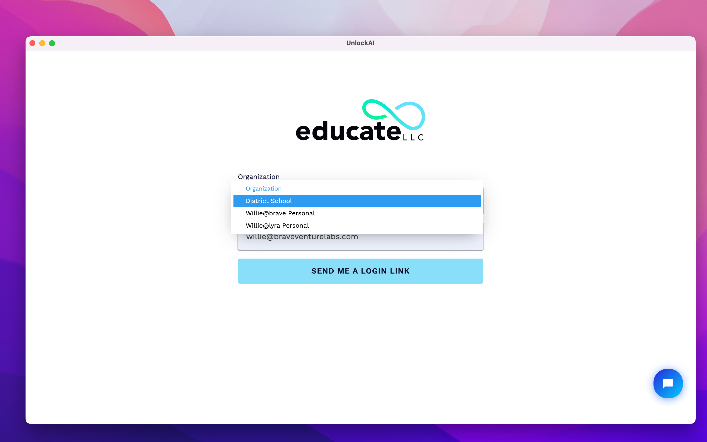
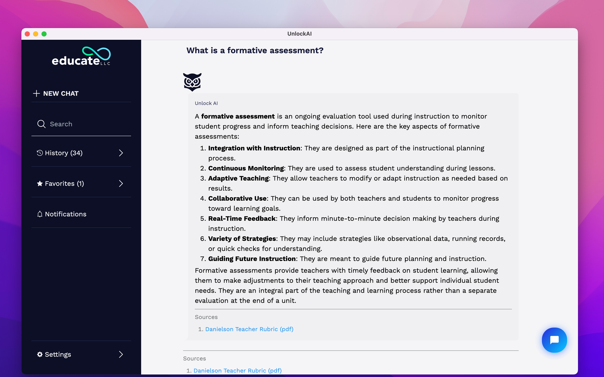
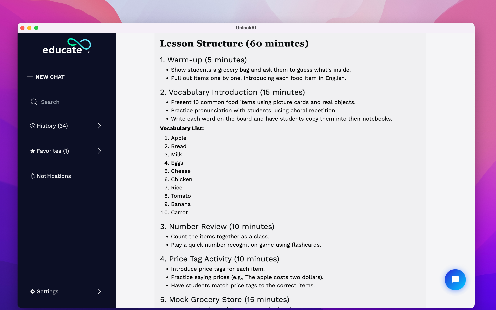
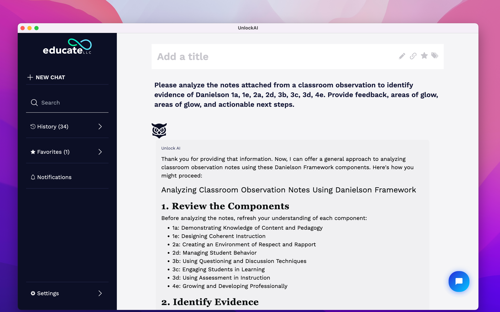
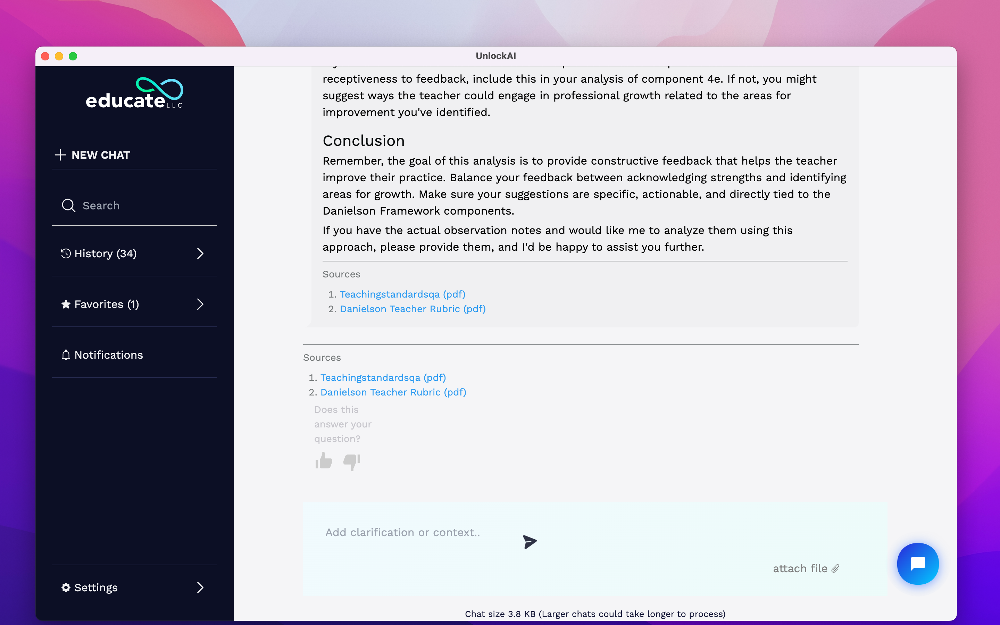
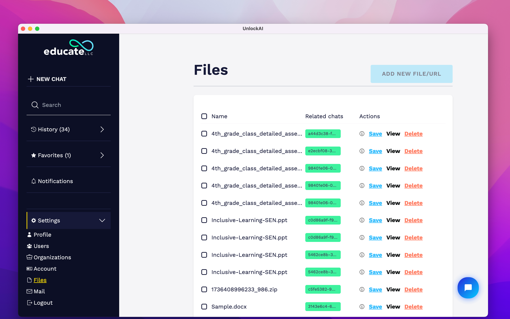

A RAG-powered AI assistant built for K-12 educators — enabling general Q&A, lesson planning, and classroom observation analysis grounded in an organization's own knowledge base.

## Overview

UnlockAI emerged from a real gap in edtech: general-purpose AI tools are powerful but untethered. Teachers asking ChatGPT about lesson planning get generic answers with no connection to their school's frameworks, standards, or approved materials. UnlockAI closes that gap by letting district administrators upload their own documents — rubrics, teaching standards, curriculum guides — and have every AI response cite directly from that knowledge base.

The product serves K-12 districts operating under structured evaluation frameworks like Danielson. It supports three core workflows: open-ended pedagogical Q&A grounded in uploaded documents, lesson plan generation tailored to specific student populations, and classroom observation analysis mapped to Danielson components with actionable feedback.

The system is multi-tenant by design. Districts onboard as organizations, manage their own user rosters and file libraries, and operate in isolated contexts. A teacher at one district never touches data from another.

## Technical Highlights

- **RAG Pipeline**: ChromaDB vector store with LangChain orchestration — every response cites the source document and page it drew from
- **Dual LLM Support**: OpenAI and Anthropic models selectable per organization, with fallback handling
- **Background Jobs**: Trigger.dev handles async document ingestion — chunking, embedding, and indexing without blocking the UI
- **File Attachments in Chat**: Users can attach documents directly to a chat message; the file is processed inline and included as context
- **Multi-Tenant Auth**: Organization-scoped sessions with role-based access (admin, member) via magic link login
- **Chat Memory**: Conversation history maintained per session; chat size surfaced to users to manage context window expectations
- **Feedback Loop**: Per-response thumbs up/down with a "Does this answer your question?" prompt feeding into quality monitoring
- **Customer Support Integration**: Tidio embedded for real-time support without leaving the app

## Stack

**Frontend**: Remix.run — chosen for its progressive enhancement model and server-side rendering, which kept the chat UI snappy even on slower school network connections. Loader/action patterns made auth and file upload flows clean without client-side state sprawl.

**Backend**: FastAPI — handling the RAG query pipeline, document ingestion endpoints, and LLM orchestration. Kept separate from the Remix layer to allow independent scaling of the AI-heavy workloads.

**Database**: PostgreSQL for all relational data (users, organizations, chats, files, metadata). ChromaDB as the vector store, colocated with the FastAPI service.

**Infrastructure**: AWS for compute and storage. Trigger.dev for background job processing — specifically document ingestion pipelines that would otherwise time out in a request/response cycle.

## Research & Discovery

### Problem Framing

The core insight driving the architecture was that educators don't need a smarter chatbot — they need a chatbot that knows their context. Most AI tools treat every user identically. UnlockAI's value proposition depends entirely on the quality of the organization's knowledge base and how faithfully the RAG pipeline retrieves from it.

This shaped every design decision: the file management UI needed to make uploading and organizing documents frictionless, response citations needed to be visible and trustworthy, and the system needed to degrade gracefully when no relevant documents existed in the index.

### User Research

Early conversations with district administrators surfaced two non-obvious requirements. First, organizations needed control over which files were "active" in the knowledge base versus simply stored — leading to the Save/View/Delete file actions with chat association tracking. Second, teachers were skeptical of AI-generated analysis without traceability — which hardened the requirement for inline source citations on every response.

### Competitive Landscape

Existing edtech AI tools either operated as generic LLM wrappers (no RAG, no org context) or were so locked into specific platforms (Google Classroom, Canvas) that standalone district deployment was impractical. UnlockAI's desktop app distribution model — built with Electron-adjacent packaging — meant districts could run it without IT needing to push a browser extension or platform integration.

## Planning & Architecture

### Multi-Tenancy Model

The organization model is the load-bearing concept in the data architecture. Every resource — files, chats, users — scopes to an organization. A user can belong to multiple organizations (surfaced in the login dropdown: District School, Willie@brave Personal, Willie@lyra Personal) and switches context at login.

This required careful thinking about file isolation: ChromaDB collections are namespaced per organization, so embedding queries never cross tenant boundaries. PostgreSQL foreign keys enforce the same at the relational layer.

### RAG Pipeline Design

Document ingestion is intentionally async. When a file is uploaded, the UI confirms receipt immediately while Trigger.dev kicks off a background job that chunks the document, generates embeddings via OpenAI, and writes vectors to ChromaDB. This prevents large PDFs (some district rubrics run 80+ pages) from timing out the upload request.

Query time works in reverse: the user's message is embedded, nearest vectors retrieved from the org's ChromaDB collection, source chunks injected into the LLM prompt as context, and the response generated with explicit citation instructions. The sources panel below each response reflects the actual documents retrieved — not post-hoc attribution.

### Chat Architecture

Remix's nested routing mapped cleanly onto the chat product structure: a persistent sidebar (history, favorites, new chat) with a main content area that could render either the new chat home screen or an active conversation. Chat state lives server-side; the client is thin.

The "Add clarification or context" follow-up input after a response — distinct from starting a new message — was a deliberate UX decision to keep refinement lightweight without treating every follow-up as a new top-level query.

## Development Process

### Phase 1 — Core RAG Loop

The first working version handled a single use case: upload a PDF, ask a question, get a cited response. No multi-tenancy, no async ingestion, no UI polish. The goal was validating that the RAG pipeline produced responses educators found trustworthy.

The critical finding: citation quality depended heavily on chunk size and overlap settings. Too large and retrieval was imprecise; too small and responses lost coherent context. Tuning this against real district documents (Danielson rubrics, teaching standards PDFs) took several iterations.

### Phase 2 — Multi-Tenancy and Auth

Introducing organizations required rearchitecting the database schema and FastAPI endpoints around tenant context. Magic link auth was chosen deliberately — district IT policies often block password managers and OAuth providers, but email delivery is always available.

Role management (admin vs member) controlled file upload permissions and user management access, keeping the settings surface clean for non-technical users.

### Phase 3 — Product Features

With the infrastructure solid, development shifted to the three core use cases visible in the product:

**General Q&A**: The default mode. Suggested prompts on the home screen (formative assessment, social-emotional learning, student interests) lower the activation energy for first-time users.

**Lesson Planning**: Context-aware generation — the model references the org's knowledge base to suggest strategies aligned with uploaded curriculum materials, not just generic pedagogy.

**Observation Analysis**: The highest-value feature for administrators. Paste classroom observation notes, specify Danielson components, receive structured feedback with areas of strength, areas for growth, and actionable next steps — all cited to the org's own rubric documents.

### Phase 4 — Ops and Support

Post-launch maintenance covered monitoring ChromaDB index health, handling edge cases in document parsing (malformed PDFs, scanned images without OCR text), and managing Trigger.dev job failures for large file uploads. Tidio integration gave users a direct support channel without context-switching away from the app.

## Design Decisions

### Prompted Suggestions Over Blank Slate

The "Try one of these" prompt cards on the new chat screen weren't just UX decoration — they were a deliberate onboarding mechanism. Educators who had never used AI tools needed concrete examples of what was possible before they'd type their own query. The six prompts cover different use cases (definition, strategy, lesson planning, differentiation, survey creation) to signal breadth without overwhelming.

### Inline Citations as Trust Infrastructure

Surfacing sources directly below each response — and repeating them at the chat footer — was a trust decision as much as a UX one. Educators operating under accountability frameworks need to know where information comes from. An AI that says "use exit tickets" without a reference to the Danielson rubric is less useful than one that cites component 3d explicitly.

### Chat Size Indicator

The "Chat size 3.8 KB (Larger chats could take longer to process)" notice at the bottom of conversations is a small but important transparency feature. It sets expectations around latency for users with long sessions and implicitly teaches them about context window constraints without requiring technical explanation.

## Challenges & Solutions

### Vector Store Scaling

ChromaDB's in-process mode works cleanly for moderate document volumes but requires careful management as organization file libraries grow. The solution was periodic re-indexing jobs and surfacing file-to-chat associations in the knowledge base UI — letting admins identify and remove orphaned or outdated documents.

### LLM Prompt Reliability

Getting the model to consistently format observation analysis responses (numbered sections, Danielson component references, actionable steps) required significant prompt engineering. Few-shot examples in the system prompt, combined with explicit formatting instructions, produced reliable structure without post-processing.

### Scanned Document Handling

Several districts uploaded scanned PDFs without embedded text. LangChain's document loaders returned empty chunks, silently producing responses with no retrieved context. The fix was adding a pre-ingestion check: if extracted text length falls below a threshold, the job fails loudly with a user-facing error rather than ingesting an empty document that produces hallucinated responses.

## Impact

UnlockAI serves multiple districts with distinct organizational contexts. The observation analysis feature has become the highest-engagement workflow — administrators use it to process classroom observation notes at scale, reducing the time from observation to written feedback significantly. The lesson planning feature sees the heaviest use among newer teachers who need curriculum scaffolding grounded in their district's approved materials.

---

- [TypeScript](https://wmik.netlify.app/tags/TypeScript)
- [Remix](https://wmik.netlify.app/tags/Remix)
- [Python](https://wmik.netlify.app/tags/Python)
- [FastAPI](https://wmik.netlify.app/tags/FastAPI)
- [PostgreSQL](https://wmik.netlify.app/tags/PostgreSQL)
- [LangChain](https://wmik.netlify.app/tags/LangChain)
- [AI/ML](https://wmik.netlify.app/tags/AI-ML)
