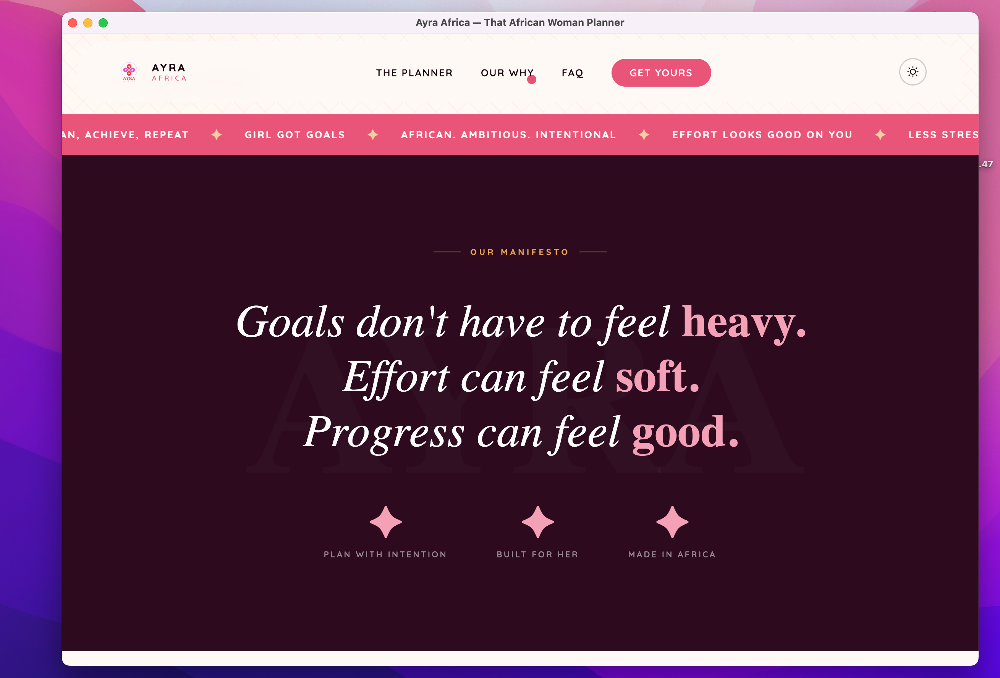
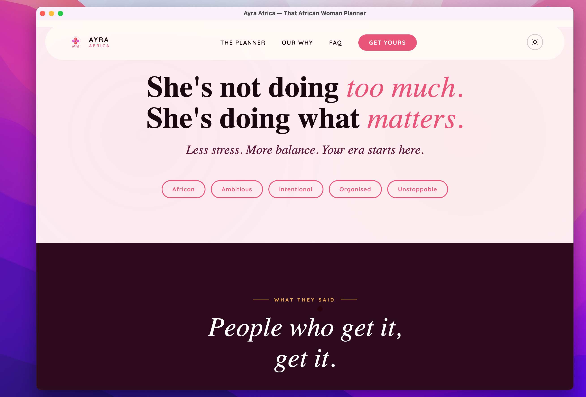
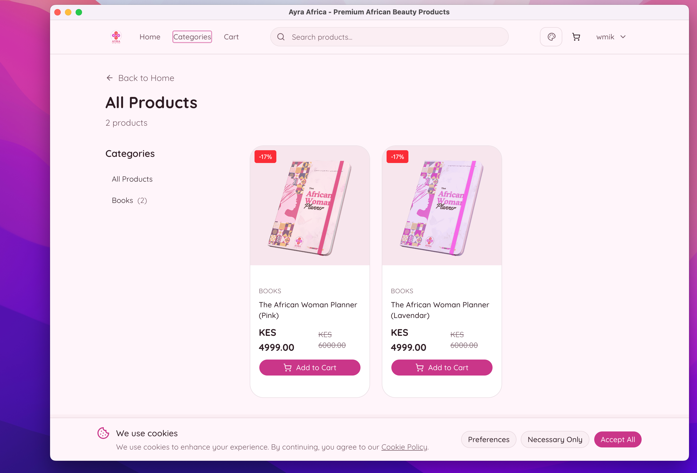
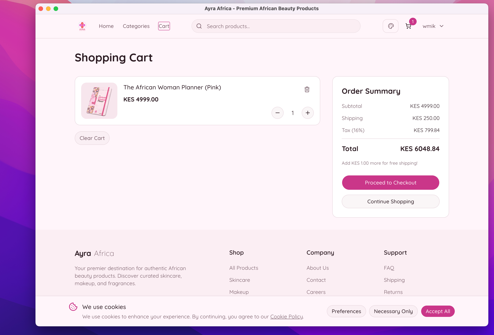
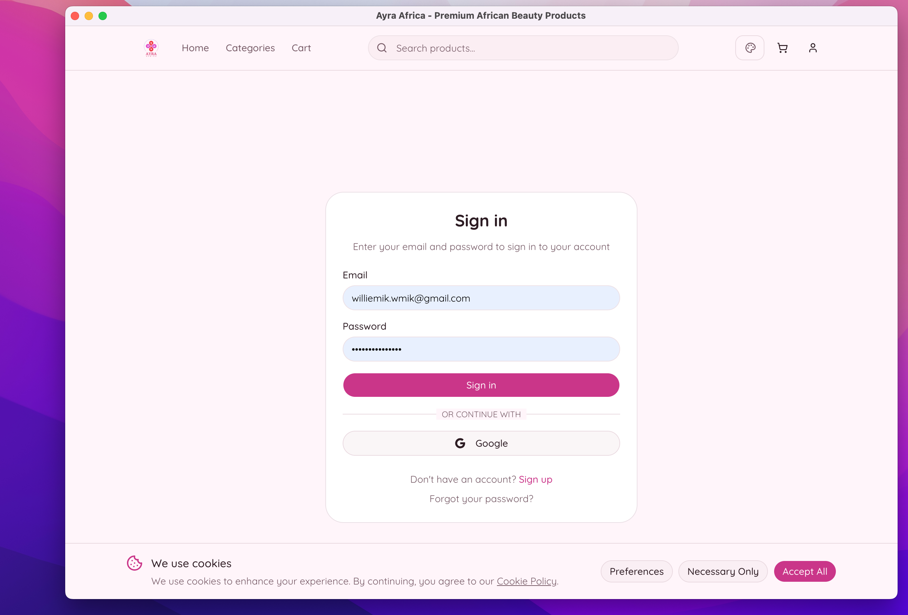

A digital brand and e-commerce platform for the ambitious African woman — a landing page built for conversion, backed by a full-stack shop with order management, background jobs, and a curated product catalogue.

## Overview

Ayra Africa is a Kenyan brand selling planners, journals, and vision tools designed specifically for the ambitious African woman. The brief was clear: build something that felt premium, culturally rooted, and commercially capable — not a generic Shopify theme with an African flag emoji.

The project split into two distinct surfaces. The marketing site (`ayraafrica.co.ke`) handles brand storytelling and acquisition. The shop (`shop.ayraafrica.co.ke`) handles product discovery, cart, checkout, and order management. Keeping them separate was a deliberate architectural decision — it let each surface be optimized independently, and meant the landing page could load fast and stay stable regardless of what was happening in the e-commerce layer.

The brand targets women who are organized, intentional, and resistant to tools that feel designed for someone else. Every copy decision, layout choice, and interaction detail was made with that positioning in mind.

## Technical Highlights

- **Zero-dependency landing page**: Plain HTML/CSS deployed on GitHub Pages — no build step, no framework overhead, sub-second load times
- **Next.js storefront**: App Router, server components, PostgreSQL via Prisma, deployed on Vercel
- **Background job processing**: Trigger.dev handles order confirmation emails and post-purchase workflows without blocking the checkout response
- **Category-scoped browsing**: Products organized by category (skincare, makeup, fragrance, planners) with dedicated routes
- **Auth flow**: Sign-in with session management for returning customers; order tracking without requiring account creation
- **Free shipping threshold logic**: Automated at KES 5,000, calculated server-side at cart evaluation
- **Customer support**: Direct support channel integrated for pre-purchase and post-purchase queries

## Stack

**Landing page**: Plain HTML + CSS hosted on GitHub Pages. The decision to avoid a framework here was deliberate — the marketing site doesn't need JavaScript hydration, component trees, or a build pipeline. It needs to load fast on Safaricom 4G, look good on mobile, and convert. GitHub Pages delivers that with zero infrastructure overhead.

**Shop**: Next.js 16 with the Page Router. Server components handle product listing and category pages without client-side data fetching. Client components are scoped to interactive surfaces: cart, auth, checkout flow.

**Database**: PostgreSQL for products, orders, users, and categories. Prisma as the ORM — schema-first, type-safe, and practical for a solo developer managing migrations across environments.

**Background jobs**: Trigger.dev for async post-checkout workflows. Order confirmation emails and inventory updates run outside the request cycle, keeping checkout response times fast regardless of third-party email delivery latency.

**Deployment**: Vercel for the Next.js shop (preview deployments per PR, zero-config edge caching). GitHub Pages for the landing page (push to deploy, no build minutes consumed).

## Research & Discovery

### Brand Positioning Research

Before any design or development work, the positioning question needed answering: what does a planner built for the African woman actually mean in practice? Generic planners fail this market not because of price or availability but because they're culturally indifferent — goal-setting frameworks that assume contexts that don't apply, budget trackers in currencies and categories that don't match lived experience.

The research phase involved studying how the target audience — ambitious Kenyan women aged 22–35 — talks about productivity, money, and personal growth online. The language that emerged ("girl got goals," "effort looks good on you," "join the Ayra era") came directly from that research, not from a copywriting brief.

### Competitive Analysis

The Kenyan stationery market has options, but the premium end is dominated by imported products with no cultural connection to the buyer. Local alternatives tend to underinvest in design and brand. The gap was clear: a well-designed, intentionally African product could own a niche that neither imported brands nor commodity local options were serving.

### Technical Platform Research

Early consideration was given to Shopify. It was ruled out for two reasons: monthly costs at the brand's current scale were disproportionate, and Shopify's customization ceiling creates a ceiling on brand differentiation. A custom Next.js storefront with PostgreSQL meant full control over the data model, the UI, and the checkout experience — at the cost of higher build time, which was acceptable given the development capacity available.

## Planning & Architecture

### Two-Surface Strategy

Separating the marketing site from the shop was the foundational architectural decision. A single Next.js app could have handled both, but it would have coupled deployment cycles, mixed concerns, and added JavaScript overhead to pages that didn't need it.

The marketing site's job is brand storytelling and acquisition — it needs to load instantly, feel emotional, and direct visitors to the shop. The shop's job is conversion and retention — it needs reliable auth, fast product pages, and a checkout flow that doesn't lose people. These are different jobs requiring different optimization strategies.

The two sites share visual identity (typography, color, brand voice) but are maintained independently. Updates to the landing page don't require a shop deployment, and shop infrastructure changes don't risk breaking the marketing surface.

### Data Model

The PostgreSQL schema centers on five core entities: products, categories, orders, order items, and users. Categories drive the shop navigation (`/category/[slug]`) and allow new product lines to be added without schema changes.

Orders capture line items, quantities, delivery address, and payment status. The trigger.dev jobs consume order records post-creation — sending confirmation emails, updating inventory counts, and flagging orders for fulfilment processing.

### Delivery Logic

Free delivery within Nairobi, paid nationwide shipping — calculated at cart evaluation based on delivery address. The threshold logic (free above KES 5,000) runs server-side at checkout to prevent client-side manipulation and ensure consistent application across sessions.

## Development Process

### Landing Page First

The landing page shipped before the shop. This was strategic: it gave the brand a presence to build social proof around (Instagram following, waitlist signups) before the shop was ready for orders. It also stress-tested the brand positioning with real audiences before committing to product and inventory decisions.

The page structure follows a deliberate conversion architecture: hero with emotional positioning → product showcase → manifesto → social proof → FAQ → CTA. Each section answers a different objection a potential buyer might have.

### Shop Development

The Next.js shop was built in phases:

**Phase 1 — Catalogue**: Product listing, category pages, product detail pages. Server-rendered, fast, SEO-friendly. This phase was shippable independently — users could browse even before checkout was ready.

**Phase 2 — Cart and Checkout**: Client-side cart state, checkout flow, address capture, payment integration. The most complex phase, requiring careful handling of edge cases: out-of-stock items added to cart, delivery address validation, payment failure recovery.

**Phase 3 — Auth and Orders**: Account creation, sign-in, order history, order tracking. Designed to be low-friction — customers can check out as guests and create an account post-purchase to track their order.

**Phase 4 — Background Jobs**: Trigger.dev integration for post-checkout workflows. Decoupling email delivery from the checkout response was critical — transactional email services have variable latency, and a slow email provider shouldn't make checkout feel slow.

### Design Decisions

**Scroll-triggered marquee**: The brand tagline strip ("Plan, Achieve, Repeat ✦ Girl got goals ✦ African. Ambitious. Intentional") runs as a continuous marquee between sections. It's a small interaction detail that signals premium brand production quality — the kind of thing that makes a site feel designed rather than assembled.

**Two cover variants**: Pink and Lavender editions of the planner give buyers a choice, which increases conversion (the paradox of choice concern doesn't apply at two options) and creates gift-purchase optionality without requiring a full product variant system.

**A5 format decision**: The planner is A5 — compact enough to carry daily, large enough to plan substantively. This was a product design input that shaped the photography brief and how the product is described across all touchpoints.

**FAQ as objection handler**: The FAQ section directly addresses the questions that kill purchases — shipping availability, payment on delivery, gift suitability, product dimensions. Each answer is written to convert, not just inform.

## Customer Support & Maintenance

Post-launch support covers two distinct flows. Pre-purchase: questions about shipping, payment options, and product details, handled via the integrated support channel and Instagram DMs. Post-purchase: order status, delivery issues, and returns — routed through the order tracking system where possible, escalated to direct support when not.

Maintenance covers dependency updates to the Next.js shop, Prisma migration management as the product catalogue grows, Trigger.dev job monitoring for failed post-purchase workflows, and GitHub Pages content updates to the landing page as campaign copy and product imagery change.

The separation of landing page from shop has reduced maintenance overhead significantly — a copy update to the marketing site is a single file edit and a git push, with no risk of affecting shop functionality.

## Challenges & Solutions

### Mobile-First on Variable Connections

The primary audience accesses the site on mobile, often on variable LTE connections. The landing page's plain HTML approach directly addresses this — no JavaScript bundle, no hydration delay. The shop required more care: images are served via Next.js Image optimization with explicit size hints, and product listing pages use static generation where possible to minimize server response times.

### Inventory Synchronisation

With two product editions at launch, inventory management is relatively simple — but the data model was designed to accommodate SKU-level stock tracking from the start. The Trigger.dev job that runs post-order decrements inventory counts asynchronously, which means there's a brief window where overselling is theoretically possible. For current volumes, this is acceptable; at scale, it would require optimistic locking at the database level.

### Brand Consistency Across Two Codebases

Maintaining visual consistency between a plain HTML landing page and a Next.js shop without a shared component library required explicit documentation of the design system: typefaces (used via Google Fonts in both), color values (duplicated in both codebases), and spacing conventions. A change to brand color requires updating two places — an acceptable trade-off at current scale for the benefits of the separated architecture.

## Impact

Ayra Africa launched to an existing Instagram audience and converted waitlist signups to first-day orders. The landing page has driven organic discovery through search and social sharing. The shop's performance on Vercel's edge network means product pages load fast regardless of where in Kenya the buyer is accessing from.

The project demonstrates what's possible at a lean budget when platform choices are made deliberately: a premium brand experience, a functional e-commerce system, and a maintainable codebase — without a Shopify subscription or a large engineering team.

---

- [HTML/CSS](https://wmik.netlify.app/tags/HTML-CSS)
- [Next.js](https://wmik.netlify.app/tags/Next.js)
- [TypeScript](https://wmik.netlify.app/tags/TypeScript)
- [PostgreSQL](https://wmik.netlify.app/tags/PostgreSQL)
- [E-commerce](https://wmik.netlify.app/tags/E-commerce)
- [Product Design](https://wmik.netlify.app/tags/Product-Design)
